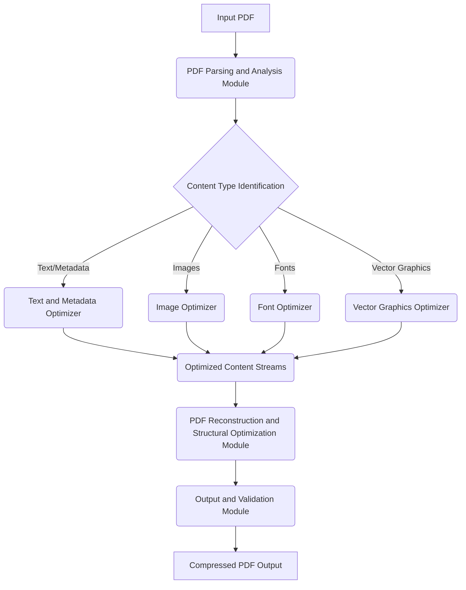

Here is the `architecture.md` file detailing the architecture and techniques for a production-ready PDF compression tool:

```markdown
# PDF Compression Tool Architecture

This document outlines the architecture for a production-ready PDF compression tool, integrating various techniques for optimal file size reduction while maintaining document integrity and quality.

## 1. Overall System Architecture

The PDF compression tool follows a modular, multi-stage processing pipeline to efficiently parse, analyze, optimize, and reconstruct PDF documents.



## 2. Module Breakdown

### 2.1. PDF Parsing and Analysis Module

This module is responsible for the initial ingestion and deconstruction of the input PDF.

*   **Functionality:**
    *   **PDF Deconstruction:** Parses the PDF byte stream to identify and extract all core PDF objects (pages, content streams, fonts, images, metadata, etc.).
    *   **Content Type Identification:** Classifies each extracted object by its type (e.g., plain text, raster image, vector graphic, embedded font, form field data) to direct it to the appropriate optimization handler.
    *   **Raw Data Extraction:** Extracts the raw, uncompressed or minimally compressed data streams for each content type.
*   **Key Considerations:** Robust error handling for malformed PDF structures.

### 2.2. Content-Specific Optimization Modules

These modules apply tailored compression techniques based on the identified content type.

#### 2.2.1. Text and Metadata Optimizer

This module focuses on lossless compression of textual content and document metadata.

*   **Techniques Employed:**
    *   **Flate (DEFLATE) Compression:** Widely used and highly effective for general text streams, balancing compression ratio and speed.
    *   **LZW (Lempel-Ziv-Welch) Compression:** Effective for repetitive patterns often found in text and code segments.
    *   **Huffman Coding:** An entropy-based coding scheme used as part of other algorithms or independently for efficient character encoding.
*   **Research Basis:** M. Kochetov (2020) "Comparison of Entropy and Dictionary Based Text Compression" [https://www.mdpi.com/2227-7390/8/7/1059/pdf], S. Yadav (2021) "A Historical Perspective on Approaches to Data Compression" [https://article.sciencepublishinggroup.com/pdf/10.11648.j.mcs.20230803.11.pdf].
*   **Advanced Considerations (Optional):** Integration of machine learning models for potentially higher compression, such as those discussed by D. Chandra (2021) "Lossless text compression using GPT-2 language model and Huffman coding" [https://www.shs-conferences.org/articles/shsconf/pdf/2021/13/shsconf_etltc2021_04013.pdf] or Y. Wang (2023) "Learning-based short text compression using BERT models" [https://peerj.com/articles/cs-2423]. For large-scale text, Y. Liu (2023) "Efficient terabyte-scale text compression via stable local consistency and parallel grammar processing" [https://arxiv.org/html/2411.12439v2] is relevant.

#### 2.2.2. Image Optimizer

This module handles image compression, offering a spectrum from lossless to various degrees of lossy compression.

*   **Techniques Employed:**
    *   **Lossless Compression (e.g., PNG, TIFF with LZW):** Used for images where no data loss is acceptable, such as medical imagery or critical scanned documents. (Refer to D. Sitaram (2023) "Lossless Compression Methods in Microscopy Data Storage Applications" [https://pmc.ncbi.nlm.nih.gov/articles/PMC9900847/]).
    *   **Lossy Compression (e.g., JPEG, JPEG2000):** Primary methods for photographic images.
        *   **Quality Settings:** User-configurable quality parameters for JPEG and JPEG2000 to balance file size and visual fidelity.
        *   **Downsampling:** Reduction of image resolution (DPI) to a user-specified target.
        *   **Quantization:** Reducing the color depth or number of unique colors in an image.
        *   **Region-of-Interest (ROI) Based Compression:** Applying different compression levels to distinct areas of an image based on their importance. (Refer to S. Saha (2024) "Image-Compression Techniques: Classical and 'Region-of-Interest-Based' Approaches" [https://www.mdpi.com/1424-8220/24/3/791/pdf?version=1706175717]).
*   **Research Basis:** S. Fadhel (2023) "Image Compression Techniques: Literature Review" [https://jqcsm.qu.edu.iq/index.php/journalcm/article/download/860/654], R. Kaur (2023) "A Survey: Various Techniques of Image Compression" [https://arxiv.org/pdf/1311.6877.pdf]. For medical images, R. Kurniawan (2021) "Significant medical image compression techniques: a review" [http://telkomnika.uad.ac.id/index.php/TELKOMNIKA/article/download/18767/10805] provides specific insights.

#### 2.2.3. Font Optimizer

This module focuses on reducing the size of embedded fonts.

*   **Techniques Employed:**
    *   **Font Subsetting:** Including only the specific glyphs (characters) that are actually used in the document, rather than the entire font file.
    *   **Duplicate Font Removal:** Identifying and eliminating redundant embeddings of the same font.
*   **Research Basis:** N. Memon (2017) "The Efficient Storage of Text Documents in Digital Libraries" [https://ejournals.bc.edu/index.php/ital/article/download/3222/2835] provides context on efficient storage for text documents, which includes font optimization.

#### 2.2.4. Vector Graphics Optimizer

This module applies lossless compression to vector graphic data.

*   **Techniques Employed:**
    *   **Flate (DEFLATE) Compression:** Applied to the stream of vector drawing commands.
    *   **Stream Optimization:** Removing redundant or unnecessary drawing commands.
*   **Research Basis:** General principles of lossless data compression apply.

### 2.3. PDF Reconstruction and Structural Optimization Module

This module takes the optimized content and reconstructs the PDF file in an efficient manner.

*   **Functionality:**
    *   **Reassemble PDF:** Integrates all compressed and optimized content streams and objects back into a valid PDF structure.
    *   **Object Stream Generation:** Consolidates multiple small PDF objects into object streams to reduce overhead and improve parsing efficiency.
    *   **Cross-Reference Table (XRef) Optimization:** Ensures the XRef table is efficiently built for fast access to objects.
    *   **Unused Object Removal:** Scans for and removes any PDF objects that are no longer referenced in the document.
*   **Advanced Considerations:** Support for direct processing in the compressed domain (P. Goyal (2014) "Direct Processing of Document Images in Compressed Domain" [https://arxiv.org/pdf/1410.2959.pdf]) could be integrated for certain operations if applicable.

### 2.4. Output and Validation Module

The final module is responsible for producing the compressed PDF and verifying its integrity.

*   **Functionality:**
    *   **File Output:** Writes the optimized PDF byte stream to a file.
    *   **Integrity Check:** Performs basic validation to ensure the output PDF is well-formed and can be opened by standard PDF readers.
    *   **Optional Quality Assessment:** For lossy compression, objective metrics (e.g., PSNR, SSIM for images) can be calculated to compare against the original or a target quality. (Refer to M. Nair (2023) "Review of Image Quality Assessment Methods for Compressed Images" [https://www.mdpi.com/2313-433X/10/5/113/pdf?version=1715160328]).
    *   **Combined Compression and Encryption (Optional):** If security is a requirement, integrate encryption with the compressed data, as explored by M. Baritha Begum (2023) [https://pmc.ncbi.nlm.nih.gov/articles/PMC10347677/] and A. Bhandari (2018) [http://downloads.hindawi.com/journals/scn/2018/9591768.pdf].

## 3. Key Architectural Principles for Production Readiness

*   **Modularity:** Each component should be self-contained and have a clear responsibility, allowing for independent development, testing, and updates.
*   **User Configuration:** A flexible API or user interface to allow users to specify compression preferences (e.g., desired quality levels for images, lossless-only mode).
*   **Performance and Scalability:** Implementations should be optimized for speed, potentially leveraging parallel processing for CPU-intensive tasks, especially for large documents.
*   **Robust Error Handling:** Comprehensive error detection and recovery mechanisms to handle corrupted input PDFs or unexpected data.
*   **PDF Standard Compliance:** Ensure that the generated compressed PDFs adhere to relevant PDF specifications to guarantee compatibility across viewers and platforms.
*   **Extensibility:** Design the architecture to easily integrate new compression algorithms or optimization techniques as research evolves.

## 4. References

*   M. Baritha Begum. (2023). An efficient and secure compression technique for data protection using burrows-wheeler transform algorithm. Heliyon. [https://pmc.ncbi.nlm.nih.gov/articles/PMC10347677/](https://pmc.ncbi.nlm.nih.gov/articles/PMC10347677/)
*   A. Bhandari. (2018). Efficient Compression and Encryption for Digital Data Transmission. Security and Communication Networks. [http://downloads.hindawi.com/journals/scn/2018/9591768.pdf](http://downloads.hindawi.com/journals/scn/2018/9591768.pdf)
*   D. Chandra. (2021). Lossless text compression using GPT-2 language model and Huffman coding. SHS Web of Conferences. [https://www.shs-conferences.org/articles/shsconf/pdf/2021/13/shsconf_etltc2021_04013.pdf](https://www.shs-conferences.org/articles/shsconf/pdf/2021/13/shsconf_etltc2021_04013.pdf)
*   S. Fadhel. (2023). Image Compression Techniques: Literature Review. Journal of Computer Science and Mathematics. [https://jqcsm.qu.edu.iq/index.php/journalcm/article/download/860/654](https://jqcsm.qu.edu.iq/index.php/journalcm/article/download/860/654)
*   P. Goyal. (2014). Direct Processing of Document Images in Compressed Domain. arXiv. [https://arxiv.org/pdf/1410.2959.pdf](https://arxiv.org/pdf/1410.2959.pdf)
*   R. Kaur. (2023). A Survey: Various Techniques of Image Compression. arXiv. [https://arxiv.org/pdf/1311.6877.pdf](https://arxiv.org/pdf/1311.6877.pdf)
*   M. Kochetov. (2020). Comparison of Entropy and Dictionary Based Text Compression. Mathematics. [https://www.mdpi.com/2227-7390/8/7/1059/pdf](https://www.mdpi.com/2227-7390/8/7/1059/pdf)
*   R. Kurniawan. (2021). Significant medical image compression techniques: a review. TELKOMNIKA. [http://telkomnika.uad.ac.id/index.php/TELKOMNIKA/article/download/18767/10805](http://telkomnika.uad.ac.id/index.php/TELKOMNIKA/article/download/18767/10805)
*   Y. Liu. (2023). Efficient terabyte-scale text compression via stable local consistency and parallel grammar processing. arXiv. [https://arxiv.org/html/2411.12439v2](https://arxiv.org/html/2411.12439v2)
*   N. Memon. (2017). The Efficient Storage of Text Documents in Digital Libraries. Information Technology and Libraries. [https://ejournals.bc.edu/index.php/ital/article/download/3222/2835](https://ejournals.bc.edu/index.php/ital/article/download/3222/2835)
*   M. Nair. (2023). Review of Image Quality Assessment Methods for Compressed Images. Journal of Imaging. [https://www.mdpi.com/2313-433X/10/5/113/pdf?version=1715160328](https://www.mdpi.com/2313-433X/10/5/113/pdf?version=1715160328)
*   S. Saha. (2024). Image-Compression Techniques: Classical and “Region-of-Interest-Based” Approaches. Sensors. [https://www.mdpi.com/1424-8220/24/3/791/pdf?version=1706175717](https://www.mdpi.com/1424-8220/24/3/791/pdf?version=1706175717)
*   D. Sitaram. (2023). Lossless Compression Methods in Microscopy Data Storage Applications. PLOS Computational Biology. [https://pmc.ncbi.nlm.nih.gov/articles/PMC9900847/](https://pmc.ncbi.nlm.nih.gov/articles/PMC9900847/)
*   Y. Wang. (2023). Learning-based short text compression using BERT models. PeerJ Computer Science. [https://peerj.com/articles/cs-2423](https://peerj.com/articles/cs-2423)
*   S. Yadav. (2021). A Historical Perspective on Approaches to Data Compression. Mathematics and Computer Science. [https://article.sciencepublishinggroup.com/pdf/10.11648.j.mcs.20230803.11.pdf](https://article.sciencepublishinggroup.com/pdf/10.11648.j.mcs.20230803.11.pdf)
```